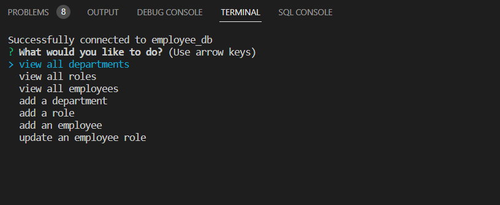

# Employee Tracker

This is a command-line application that will allow users to view and manage the departments, roles, and employees in their company. 

## Usage

The user will run "node index.js". The user will then be presented with the options to view all departments, roles, employees, add a department, add a role, and update an employee role. When the user chooses to view all departments they are presented with a formatted table showing department names and id's. When the user chooses to view all roles they are presented with the job title, role id, the deparment the role belongs to, and the salary for that role. Whent the user chooses to view all employees they are presneted with a formatted table showing employee data, including employee ids, first names, last names. When the user chooses to add a department they are prompted to enter the nam,e of the department and that department is added to the database. When the uses chooses to addd a role they are prompted to enter the name, salary, and department for the role and that role is added to the database. When the user is chooses to add an employee they are promptedto enter the employee's first name, last name, role, and manager, and that employee is added to the database. when the user chooses to update an employee role they are prompted to select an employee to update and their new role and this information is updated in the database. 

## Screenshots

## Demo
https://drive.google.com/file/d/1U06QjU0NW51f59Qui2R7JKHpgnwKhnK7/view

## Features

- Uses JavaScript
- Uses Node.js
- Uses Inquirer 
- Uses MySQL

## License

[MIT](https://choosealicense.com/licenses/mit/)

